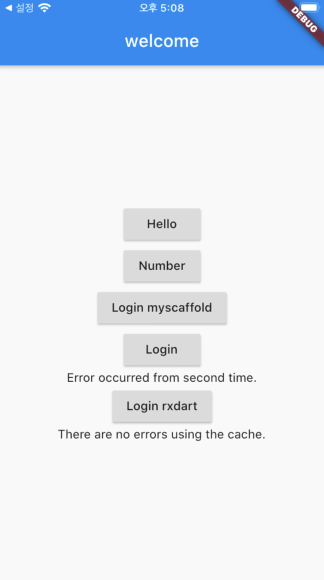
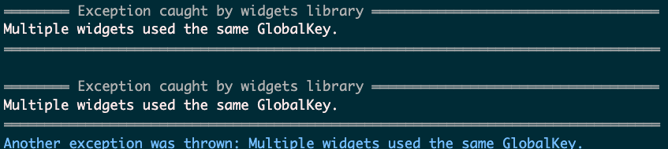

# flutter_test
 flutter test, example

# loign_bloc
- validation after submit clicked
- Login page is Error occurred from second time.
- Login rxdart is no errors using the cache.

## welcome
- my_scaffold.dart build
- using snackbar on my_scaffold and origin scaffold
- Attentoin: Multiple widgets used the same GlobalKey. on my_scaffold

### Images
- Welcome
    - 
- Multiple widgets used the same GlobalKey.
    - 